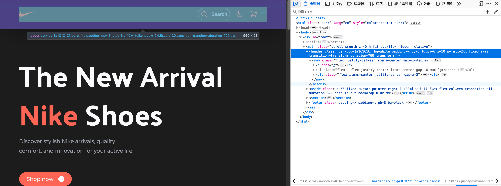
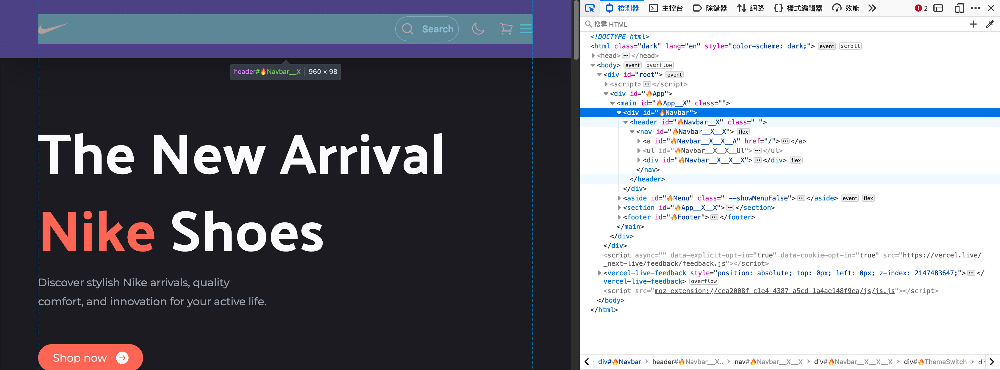
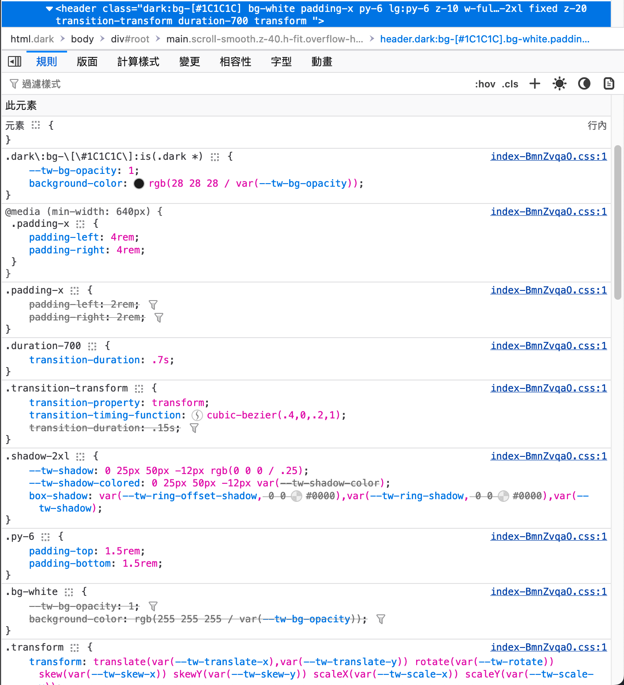
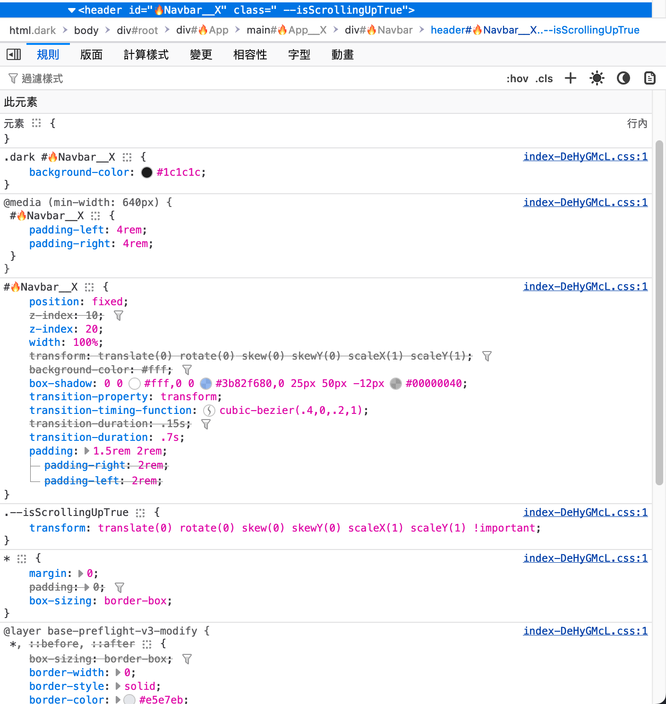
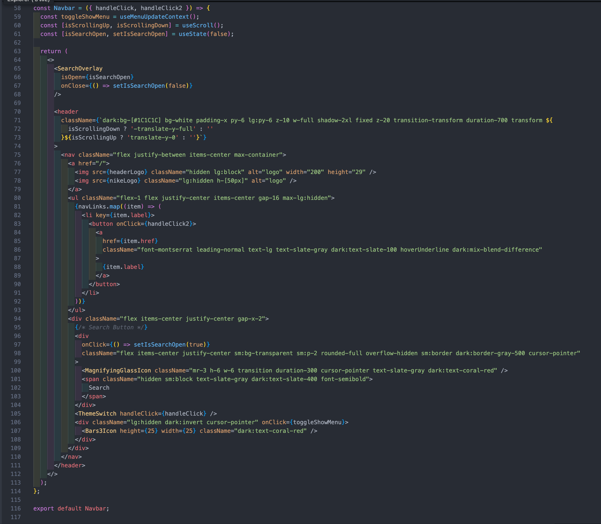
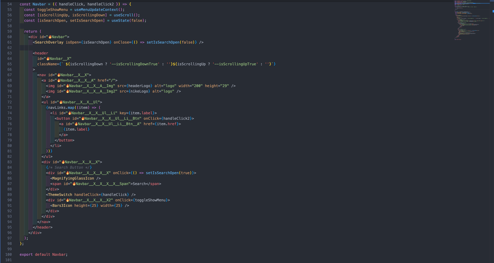

    updated on: 25th October 2024, Friday

    <a href="https://niike.vercel.app">
        
    

    </a>
    
Just Do it!

    
    

# Purpose
In the Nike project, fully convert Tailwind classes to the ESCSS version without altering the structure or attributes to enable a baseline comparison.

## Live Demo
- [Original(Tailwind) version](https://niike.vercel.app/)
- [ESCSS version](https://demo-nike.vercel.app/)

## Comparison 
### Google Speed:

#### Tailwind 
Same
#### ESCSS
Same

### HTML Structure
#### Tailwind 
 
#### ESCSS 

### DevTool
#### Tailwind

#### ESCSS

### VSCode
#### Tailwind 
 
#### ESCSS  

### CSS size
#### Tailwind 
 9.21 kB 
#### ESCSS
 11.59 kB 

## Reference
[Nike repo](https://github.com/warmachine028/nike)